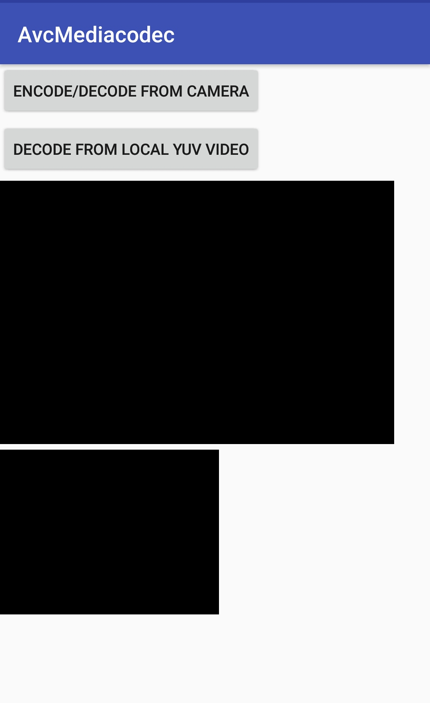

About :

MediaCodec Encode Decode !

After First build , Allow Camera and Storage Permission from setting tags manually.

After Giving Permission , you will be able to see this Mainactivity.

</img>

Now if You Click on "Encode/Decode from Camera", it will start camera on first Preview and saving stream at " Environment.getExternalStorageDirectory() + "/AvcEncode/testEncode.h264" " and same time it starts decoding at second surface view.

Now click on "Decode from local YUV Video" , it will start decoding same stream from " Environment.getExternalStorageDirectory() + "/AvcEncode/testEncode.h264" and show on both surface.

<b>Task :</b>

Instead of Showing Images on surface View from decoding a file , we want to store every Image in our gallery. For this We have to make changes in our decoding files. 

Let me know if you get any queries, Contact me at himanshu@movense.com

<b> Best of Luck </b>
